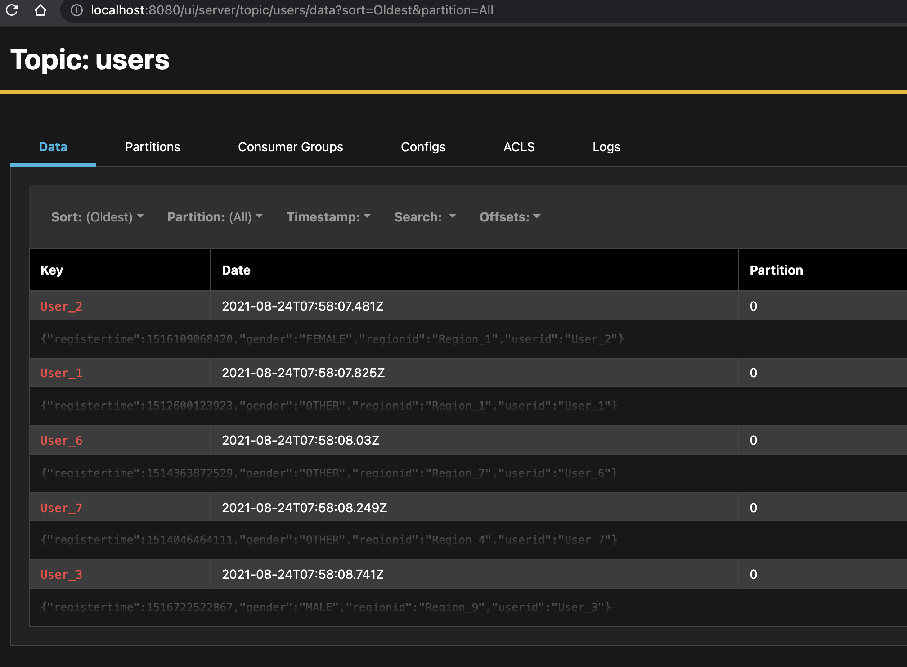
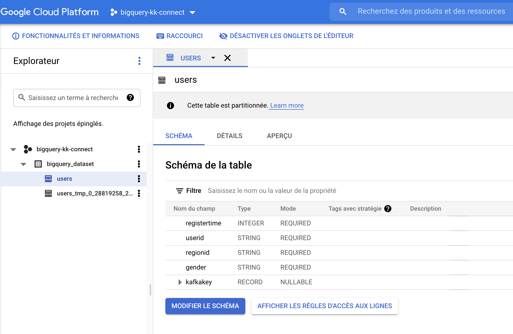
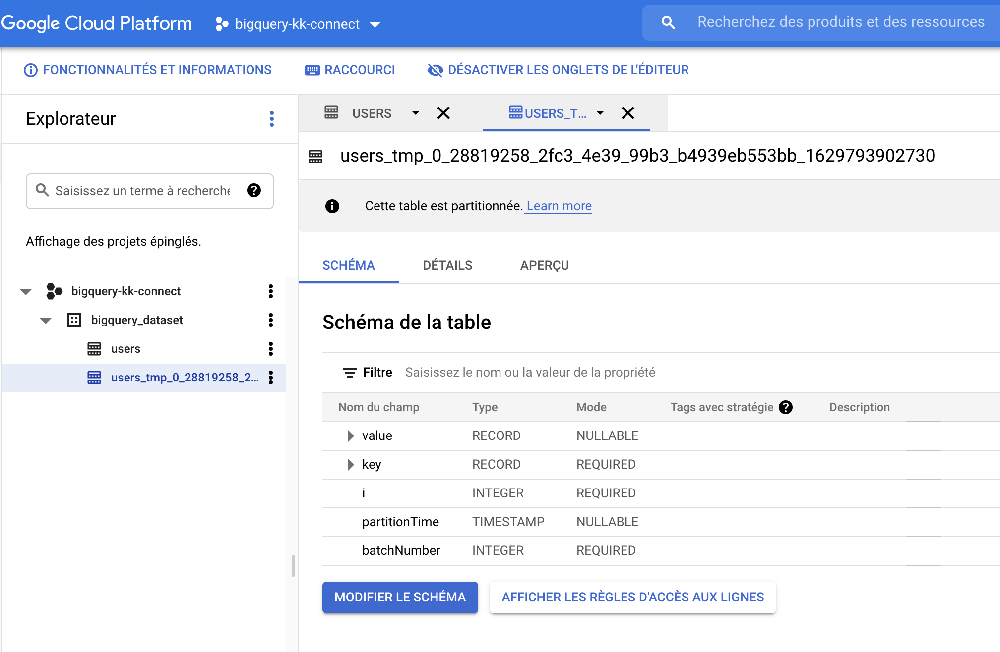
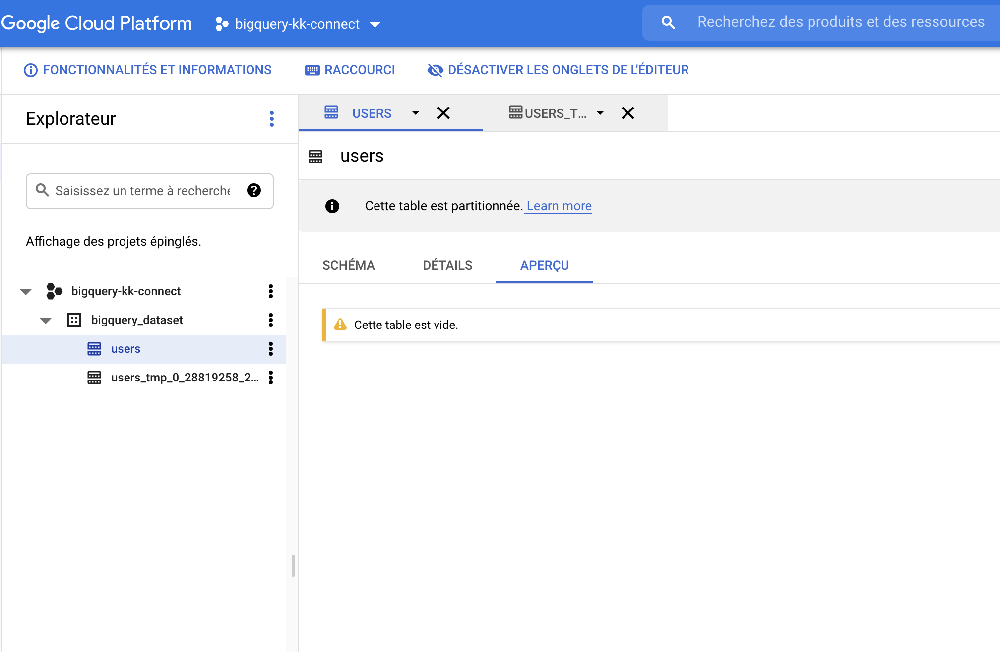
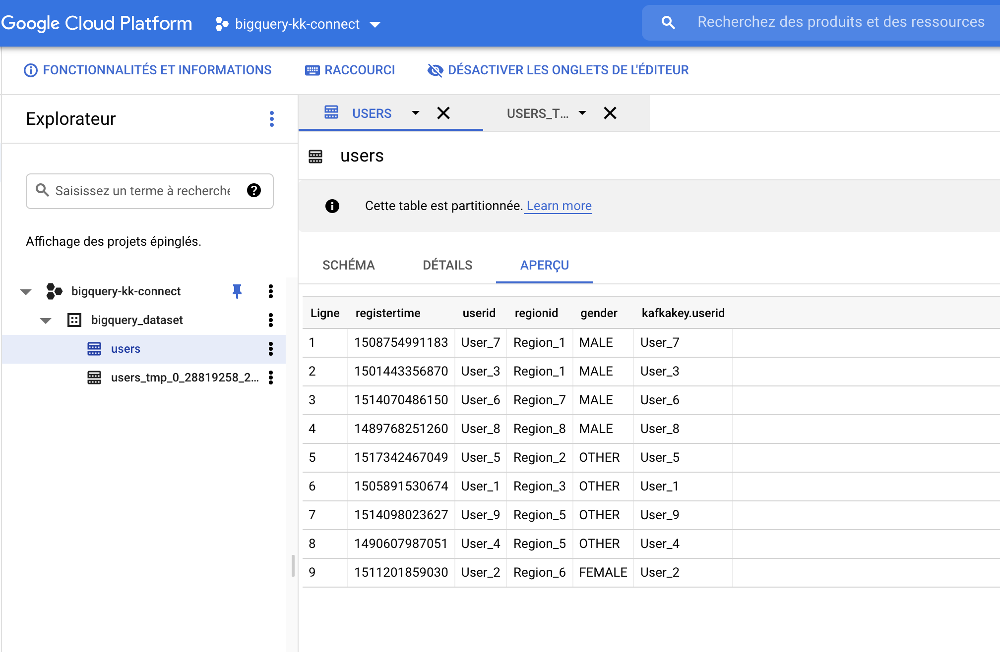

# full-stack-local

## Getting Started
To start `full-stack-local`:

```bash
docker-compose up -d --build
Building connect
[+] Building 1.5s (7/7) FINISHED
 => [internal] load build definition from Dockerfile                                                                                                                     0.0s
 => => transferring dockerfile: 654B                                                                                                                                     0.0s
 => [internal] load .dockerignore                                                                                                                                        0.0s
 => => transferring context: 2B                                                                                                                                          0.0s
 => [internal] load metadata for docker.io/confluentinc/cp-kafka-connect-base:6.1.1                                                                                      1.3s
 => [1/3] FROM docker.io/confluentinc/cp-kafka-connect-base:6.1.1@sha256:7d2a12d6728bc60fb4bed131766d0f38346b05e900fd686d0ecb2f2d4b7ebf40                                0.0s
 => CACHED [2/3] RUN confluent-hub install --no-prompt wepay/kafka-connect-bigquery:2.1.0                                                                                0.0s
 => CACHED [3/3] RUN confluent-hub install --no-prompt confluentinc/kafka-connect-datagen:0.4.0                                                                          0.0s
 => exporting to image                                                                                                                                                   0.0s
 => => exporting layers                                                                                                                                                  0.0s
 => => writing image sha256:c65f4dedf881fe009577c9700849709d82142b73e43c3681005b8671ab120b8a                                                                             0.0s
 => => naming to docker.io/library/full-stack-local_connect                                                                                                              0.0s

Use 'docker scan' to run Snyk tests against images to find vulnerabilities and learn how to fix them
Creating kafka           ... done
Creating schema-registry ... done
Creating connect         ... done
Creating zk              ... done
Creating akhq            ... done
```

Verify if `kafka-connect` is up and running.
Check `connect` logs :
```bash
docker logs connect
```
You are suppose to read this lines:
```bash
[2021-08-24 07:53:56,198] INFO [Worker clientId=connect-1, groupId=connect] Finished starting connectors and tasks (org.apache.kafka.connect.runtime.distributed.DistributedHerder)
```

## Get GCP Service Account

BigQuery connectors need a service account in order to connect to GCP BigQuery Datasets.
Put your `serviceaccount.json` in `./config/gcp/`.

Verify that your service account has these roles:
```
bigquery.datasets.get
bigquery.jobs.create
bigquery.tables.create
bigquery.tables.delete
bigquery.tables.get
bigquery.tables.getData
bigquery.tables.list
bigquery.tables.update
bigquery.tables.updateData
```

## Add connectors

Upload `datagen` connectors:
```bash
curl -v -X POST -H "Content-Type: application/json" --data "@./datagen.json" http://localhost:8083/connectors
Response code: 201 (Created); Time: 69ms; Content length: 584 bytes
```

Verify that you have data in `users` topic in AKHQ `http://localhost:8080/ui/server/topic/users/data?sort=Oldest&partition=All`




Upload `bigquery` connectors config:
```bash
curl -v -X POST -H "Content-Type: application/json" --data "@./bigquery.json" http://localhost:8083/connectors
Response code: 201 (Created); Time: 69ms; Content length: 584 bytes
```


## BigQuery Console

Now you have two table create in GCP console.

`users` table:


and an intermediate table in order to upsert correctly data inside `users` table.



The `users` table is empty:



After 1 minute (default value of `mergeIntervalMs` property is `60_000L`) you will have last data about USERS datagen in `users` table based on struct key `userid`.




## Kafka Connect logs

You can consult logs of kafka connect.
I push my logs here inside this repo `./connect.log`